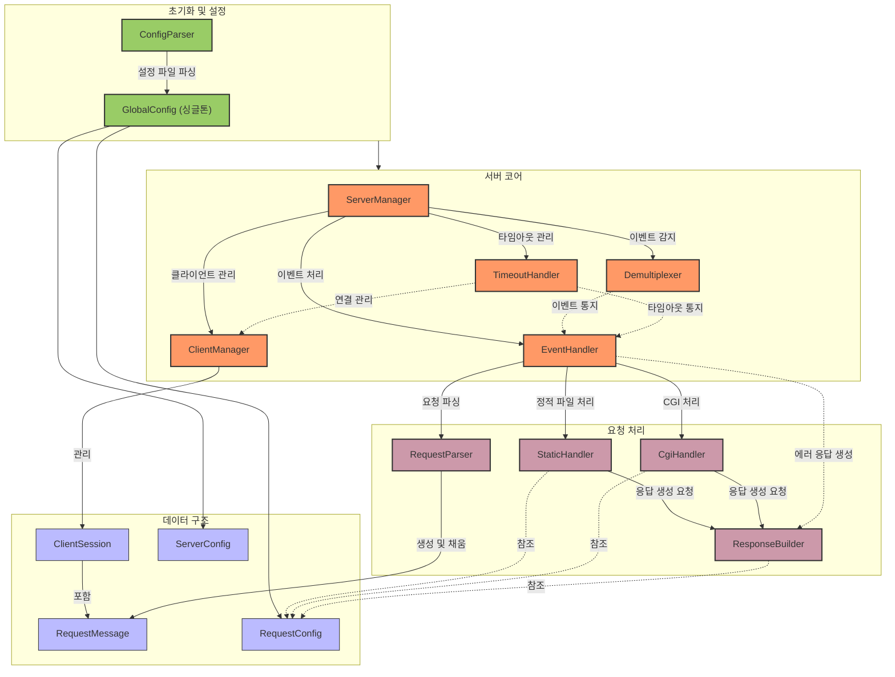
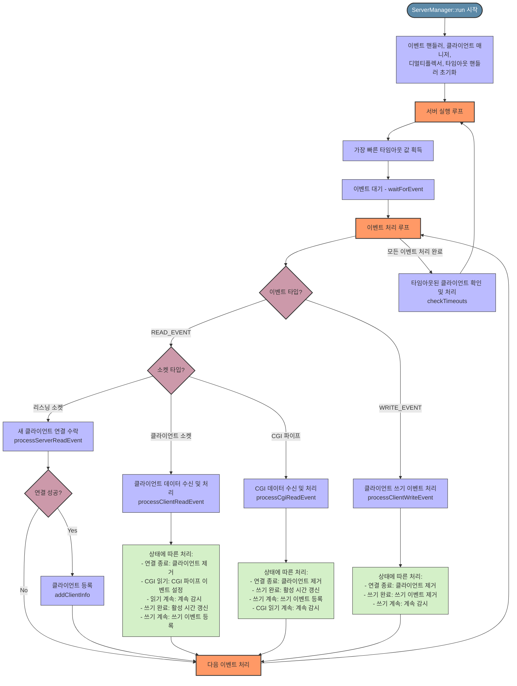
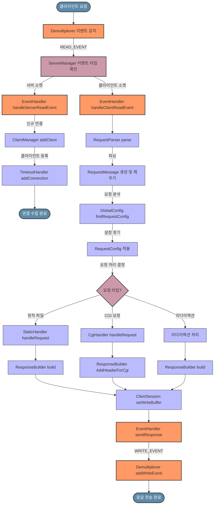

# WebServ - C++98 HTTP 서버 구현


[](https://img.shields.io/badge/platform-macOS-lightgrey)

## 개요

WebServ는 C++98로 구현된 경량 HTTP 서버로 HTTP/1.1 프로토콜을 지원합니다. 이 프로젝트는 현대적인 웹 서버 구현을 통해 핵심 네트워킹 개념, 이벤트 기반 프로그래밍 및 논블로킹 I/O를 보여줍니다.

## 특징

- HTTP/1.1 프로토콜 지원
- 이벤트 기반 아키텍처를 통한 논블로킹 I/O
- 설정 가능한 가상 호스트 및 서버 설정
- 정적 파일 제공
- CGI 스크립트 처리 지원
- 사용자 정의 오류 페이지
- 요청 타임아웃 처리
- 다중 클라이언트 연결 지원

## 아키텍처

서버는 Reactor 패턴을 사용한 이벤트 기반 아키텍처로 구축되었습니다. macOS에서는 이벤트 멀티플렉싱을 위해 kqueue를 활용합니다.



## 디렉토리 구조

```
src/
├── GlobalConfig/        # 서버 설정 저장
├── ConfigParser/        # 설정 파일 파싱
├── ServerManager/       # 서버 라이프사이클 및 메인 루프
├── Demultiplexer/       # I/O 이벤트 멀티플렉싱 처리(kqueue)
├── EventHandler/        # 이벤트 처리
├── ClientManager/       # 클라이언트 세션 관리
├── ClientSession/       # 클라이언트 연결 상태
├── RequestMessage/      # HTTP 요청 메시지
├── RequestParser/       # HTTP 요청 파싱
├── RequestHandler/      # HTTP 요청 처리 (정적 콘텐츠 및 CGI)
├── ResponseBuilder/     # HTTP 응답 구성 및 생성
├── TimeoutHandler/      # 연결 타임아웃 관리
├── include/             # 공통 헤더 파일
└── utils/               # 유틸리티 함수
```

## Event Loop

이벤트 루프는 이벤트를 기다리고, 이벤트 유형에 따라 처리하며, 클라이언트 연결을 관리하는 순차적 패턴을 따릅니다.



## HTTP 요청 처리 흐름



1. **이벤트 감지**: Demultiplexer가 클라이언트 연결에서 읽기 이벤트 감지
2. **요청 파싱**: EventHandler가 RequestParser를 통해 클라이언트 요청 처리
3. **설정 선택**: GlobalConfig가 요청에 적합한 설정 찾기
4. **요청 처리**: StaticHandler 또는 CgiHandler가 요청 처리
5. **응답 구성**: ResponseBuilder가 HTTP 응답 구성
6. **응답 전송**: 서버가 클라이언트에게 응답 전송

## 빌드 및 실행

### 요구 사항

- C++98 지원 C++ 컴파일러
- macOS (kqueue 지원용)

### 컴파일

```bash
# 레포지토리 클론
git clone https://github.com/yourusername/webserv.git
cd webserv

# 프로젝트 빌드
make

# 설정 파일로 실행
./webserv configs/default.conf

```

## 설정

서버는 Nginx와 유사한 설정 파일을 통해 구성됩니다. 예시:

```
server {
    listen 127.0.0.1:8080;
    server_name localhost;

    root /var/www/html;
    index index.html;

    error_page 404 /error/404.html;

    location / {
        methods GET POST;
        autoindex on;
    }

    location /cgi-bin {
        cgi_extension .py;
        methods GET POST;
    }
}

```

## 컴포넌트 문서

각 컴포넌트에 대한 자세한 문서는 해당 README 파일을 참조하세요:

- [ClientManager](src/ClientManager/README.md)
- [ConfigParser](src/ConfigParser/README.md)
- [Demultiplexer](src/Demultiplexer/README.md)
- [EventHandler](src/EventHandler/README.md)
- [GlobalConfig](src/GlobalConfig/README.md)
- [RequestHandler](src/RequestHandler/README.md)
- [RequestParser](src/RequestParser/README.md)
- [ServerManager](src/ServerManager/README.md)
- [TimeoutHandler](src/TimeoutHandler/README.md)

## 개발 팀원

- sehyupar
- seonseo
- damin
- taerakim