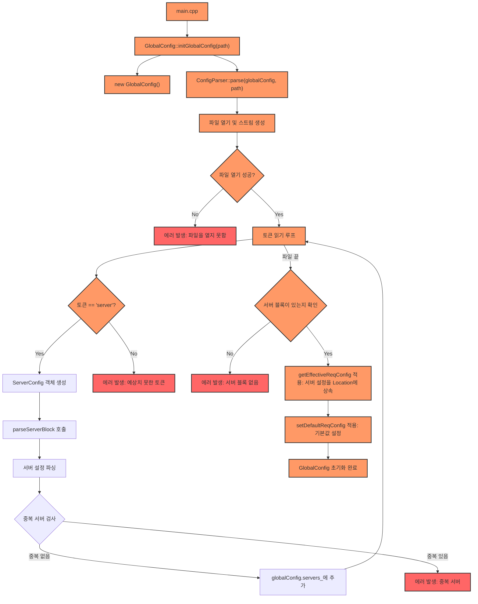
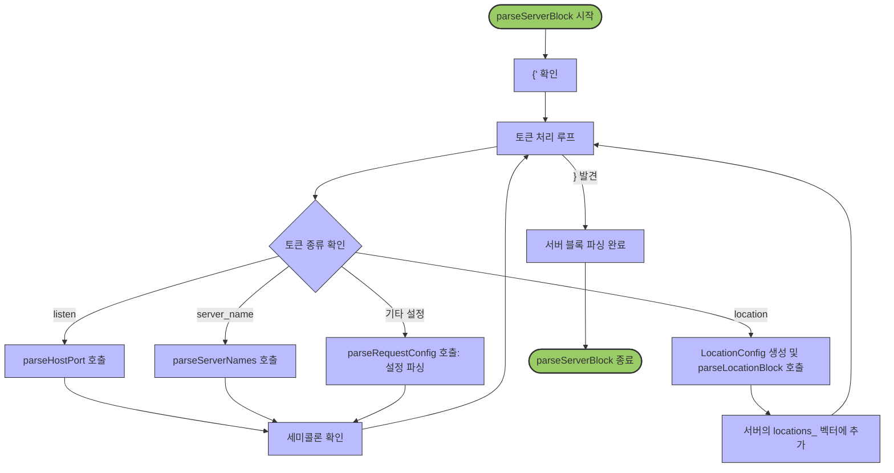
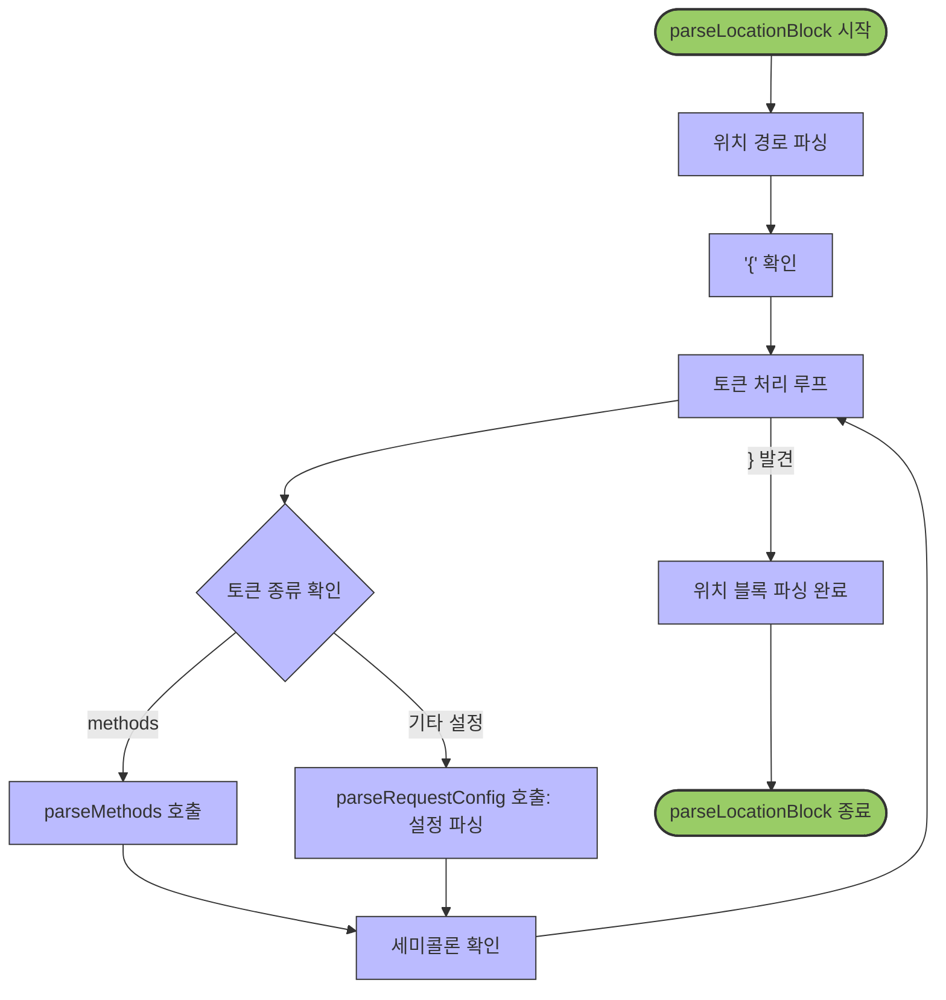

웹 서버의 설정 파일을 파싱하여 GlobalConfig 객체로 변환하는 모듈입니다.

## 핵심 구조

```
GlobalConfig (싱글톤)
└── ServerConfig (여러 개)
    ├── 기본 설정 (RequestConfig)
    └── LocationConfig (여러 개)
        └── 위치별 설정 (RequestConfig)
```

## 주요 기능

- **토큰 파싱**: 설정 파일에서 토큰 추출 및 처리
- **서버/위치 블록 파싱**: 계층적 설정 구조 구성
- **지시문 처리**: 다양한 설정 지시문 파싱 (`listen`, `root`, `methods` 등)
- **설정 상속**: 위치 블록이 서버 설정을 상속
- **기본값 적용**: 필수 설정에 대한 기본값 제공

# 웹서버 설정 파싱 프로세스

이 다이어그램들은 웹서버의 설정 파일 파싱 프로세스를 시각화합니다. 설정 파일에서 서버 구성을 로드하는 전체 과정을 3단계로 나누어 설명합니다.

### 1. 메인 설정 프로세스



메인 설정 프로세스는 설정 파일 초기화의 전체 흐름을 보여줍니다:

- `main.cpp`에서 `GlobalConfig::initGlobalConfig(path)` 호출
- `GlobalConfig` 인스턴스 생성 및 `ConfigParser::parse` 호출
- 설정 파일 열기 및 토큰화
- 서버 블록 식별 및 파싱
- 중복 서버 검사 및 오류 처리
- 설정 상속 메커니즘 적용 (서버 설정을 Location에 상속)
- 기본값 설정 및 초기화 완료

### 2. 서버 블록 파싱 프로세스



서버 블록 파싱 프로세스는 개별 서버 설정 블록을 처리하는 방법을 보여줍니다:

- `{` 문자 확인으로 블록 시작 인식
- 토큰 처리 루프 시작
- 토큰 유형에 따라 다른 파싱 함수 호출:
    - `listen` 지시문: `parseHostPort` 호출
    - `server_name` 지시문: `parseServerNames` 호출
    - `location` 지시문: `LocationConfig` 생성 및 `parseLocationBlock` 호출
    - 기타 설정: `parseRequestConfig` 호출
- 각 지시문 뒤에 세미콜론 확인
- Location 설정을 서버의 locations_ 벡터에 추가
- `}` 문자를 만나면 서버 블록 파싱 완료

### 3. 위치 블록 파싱 프로세스



위치 블록 파싱 프로세스는 URL 경로별 특정 설정을 처리하는 방법을 보여줍니다:

- 위치 경로 파싱 (예: `/api/`, `/static/`)
- `{` 문자 확인으로 블록 시작 인식
- 토큰 처리 루프 시작
- 토큰 유형에 따라 처리:
    - `methods` 지시문: `parseMethods` 호출 (GET, POST, DELETE 등)
    - 기타 설정: `parseRequestConfig` 호출
- 각 지시문 뒤에 세미콜론 확인
- `}` 문자를 만나면 위치 블록 파싱 완료

## 설정 파일 문법

[설정파일 문법](../../doc/CONFIG_SYNTAX.md)

## 설계 특징

- **모듈화**: 기능별 소스 파일 분리 (`get_next_token.cpp`, `parse_server_block.cpp` 등)
- **계층적 구조**: 설정의 명확한 계층적 표현
- **상속 메커니즘**: 중복 설정 감소
- **견고한 에러 처리**: 상세한 오류 메시지 제공
- **C++98 호환성**: 모든 코드는 C++98 표준 준수

[메인 README로 돌아가기](../../README.md)