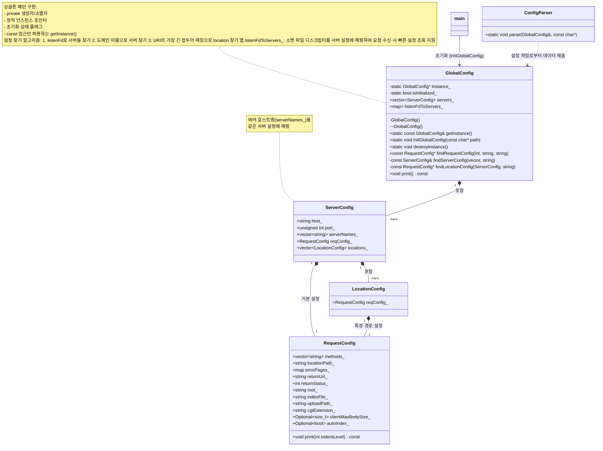

## 개요

`GlobalConfig`는 웹 서버의 모든 설정을 관리하는 싱글톤 클래스입니다. 설정 파일에서 파싱한 데이터를 계층적으로 구성하고, HTTP 요청에 맞는 설정을 효율적으로 조회합니다.

## 클래스 다이어그램



## 핵심 아이디어

### 1. 싱글톤 패턴

- 전체 애플리케이션에서 단일 설정 인스턴스 보장
- 접근 제한자와 정적 메서드로 안전한 인스턴스 관리
- 초기화 상태 확인을 통한 오류 방지

```cpp
// 사용 예시
int main() {
    GlobalConfig::initGlobalConfig("config.conf"); // 초기화 (한 번만)
    const GlobalConfig& config = GlobalConfig::getInstance(); // 인스턴스 접근
    // ...
    GlobalConfig::destroyInstance(); // 종료 시 정리
}

```

### 2. 계층적 설정 구조

- **GlobalConfig**: 전체 설정 관리
- **ServerConfig**: 서버(호스트/포트) 별 설정
- **LocationConfig**: URL 경로별 설정
- **RequestConfig**: 실제 요청 처리 규칙

### 3. 최적화된 설정 조회 (3단계 검색)

1. **리스닝 소켓**으로 해당 서버 목록 찾기
2. **도메인 이름**으로 특정 서버 찾기
3. **URL 경로**에 가장 잘 맞는 설정 찾기 (최장 접두어 매칭)

```cpp
// HTTP 요청 처리 시
const RequestConfig* config =
    globalConfig.findRequestConfig(listenFd, "example.com", "/blog/post/123");

```

### 4. 성능 최적화

- `listenFdToServers_` 맵: 소켓 → 서버 설정 O(1) 조회
- 주소/포트 별 가상 호스트 지원
- 서버 설정 간 포인터 참조로 메모리 효율성 확보

## 주요 클래스 요약

### GlobalConfig

웹 서버 전체 설정 관리 및 효율적인 설정 조회 제공

### ServerConfig

특정 호스트/포트 조합에 대한 서버 설정

- 가상 호스트 지원 (`serverNames_`)
- 기본 요청 설정 (`reqConfig_`)
- 위치별 설정 목록 (`locations_`)

### LocationConfig

URL 경로별 특수 설정

### RequestConfig

실제 HTTP 요청 처리 규칙

- 허용 메서드, 오류 페이지, 리다이렉션
- 파일 처리, CGI 실행, 본문 크기 제한 등

## 설정 파일 문법

[CONFIG_SYNTAX.md](../../doc/CONFIG_SYNTAX.md)

## 설계 장점

- **확장성**: 새로운 설정 유형 쉽게 추가 가능
- **유지보수성**: 관심사 분리로 코드 구조 명확
- **성능**: 최적화된 조회 알고리즘과 메모리 사용
- **유연성**: nginx 스타일의 설정 파일 구조 지원

[메인 README로 돌아가기](../../README.md)