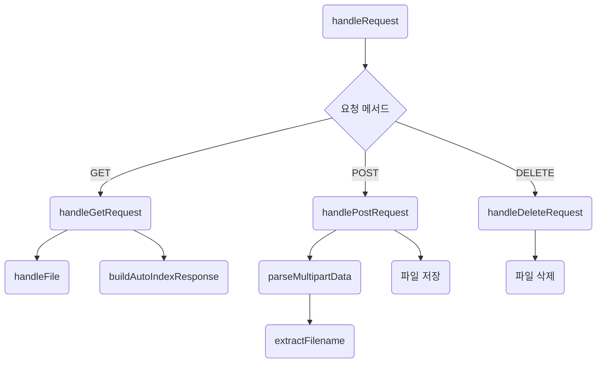
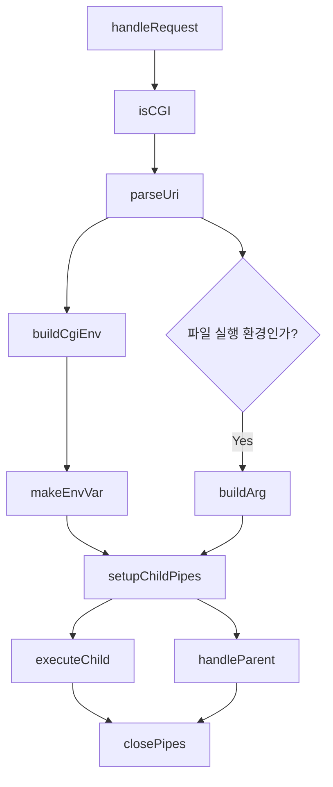

# RequestHandler

## 📂 Directory Structure

```
src/RequestHandler/
├── CgiHandler.cpp
├── CgiHandler.hpp
├── StaticHandler.cpp
└── StaticHandler.hpp
```
## 🔄 Flow Summary

요청을 받아 적절한 핸들러로 분기하며, 각 핸들러는 내림적으로 세부 처리를 댓는 방식입니다.


## 📌 Handler Details

### 📁 StaticHandler

정적 파일 요청을 처리합니다.

- `handleRequest()` : 메서드(GET/POST/DELETE)에 따라 처리 함수 분기
- `handleGetRequest()` : 정적 파일 응답 생성 또는 디렉토리 목록 생성
- `handlePostRequest()` : multipart 데이터를 파싱하고 파일로 저장
- `handleDeleteRequest()` : 파일 삭제 처리
- 기타 `handleFile()`, `parseMultipartData()` 등 유틸 함수 존재

### 🧪 CgiHandler

동적 CGI 스크립트 요청을 처리합니다.

- `handleRequest()` : CGI 요청 전처리 및 실행
- `isCGI()` : CGI 요청인지 확인
- `parseUri()` : URI 분석
- `buildArg()`, `buildCgiEnv()` : 실행 인자 및 환경 변수 구성
- `setupChildPipes()`, `executeChild()`, `handleParent()` : 프로세스 관리


## 📊 Mermaid Flowcharts

### 📁 StaticHandler



### 🧪 CgiHandler




## 📝 Example Use (Pseudo)

```
if (isCGI(request))
    CgiHandler().handleRequest(request, config);
else
    StaticHandler().handleRequest(request, config);
```

[메인 README로 돌아가기](../../README.md)